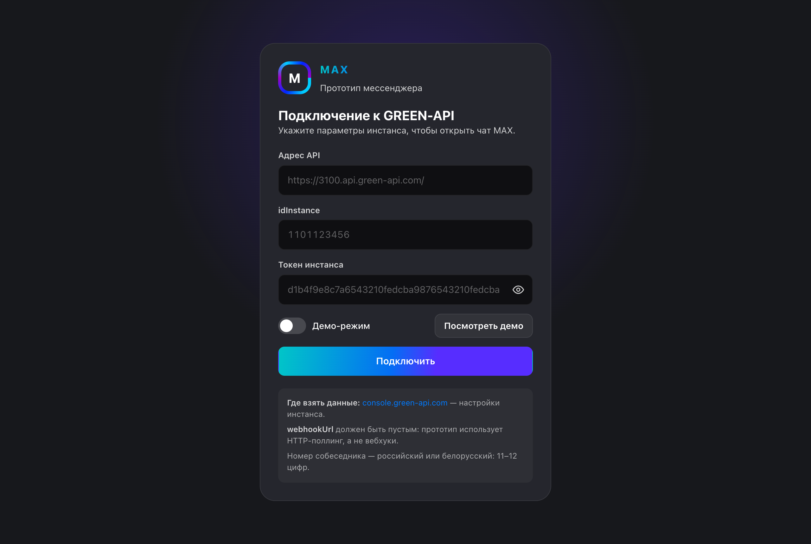
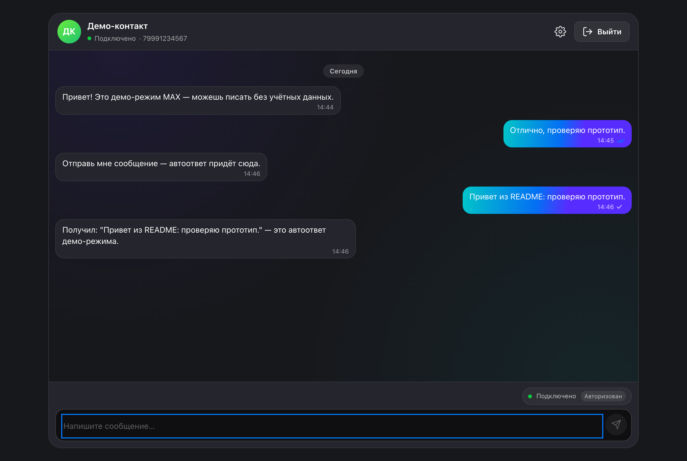
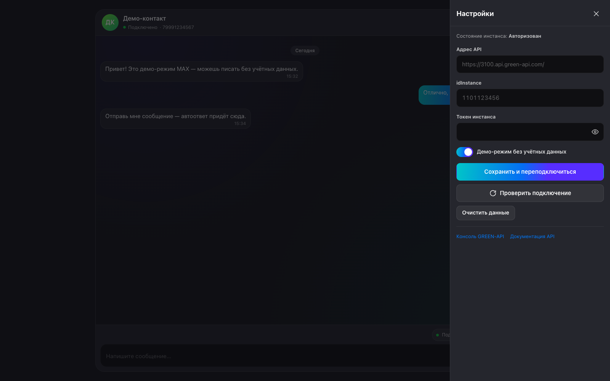
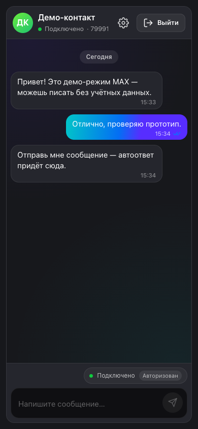

# MAX Prototype — веб-чат мессенджера MAX на API GREEN-API

Тестовый прототип: React + TypeScript + Vite приложение, которое работает как
веб-клиент мессенджера **MAX** через HTTP API **GREEN-API** (MAX, v3).

Прототип реализует полный сценарий целиком: подключение к инстансу →
выбор собеседника по номеру телефона (`checkAccount`) → отправка сообщения с
оптимистичным `pending` → приём входящих через длинный опрос
(`receiveNotification`) → статусы исходящих `sent / delivered / read`, история
переписки (`getChatHistory`) и баннер состояния инстанса. Работает и на реальном
GREEN-API, и в **демо-режиме** — встроенном in-memory фейке того же контракта,
где весь сценарий можно прокликать без учётных данных.

## Содержание

- [Возможности](#возможности)
- [Как проверить за минуту](#как-проверить-за-минуту)
- [Соответствие требованиям тестового задания](#соответствие-требованиям-тестового-задания)
- [Требования](#требования)
- [Команды](#команды)
- [Переменные окружения](#переменные-окружения)
- [Демо-режим](#демо-режим)
- [Подключение реального инстанса GREEN-API (MAX)](#подключение-реального-инстанса-green-api-max)
- [Используемые методы GREEN-API](#используемые-методы-green-api)
- [Архитектура](#архитектура)
- [Ограничения и что не реализовано](#ограничения-и-что-не-реализовано)
- [Отладка и типичные ошибки](#отладка-и-типичные-ошибки)
- [Безопасность](#безопасность)
- [Развёртывание](#развёртывание)
- [Тесты](#тесты)

## Возможности

- [x] Подключение к инстансу GREEN-API (MAX) по `apiUrl` + `idInstance` + `apiTokenInstance`
- [x] Демо-режим без учётных данных (in-memory фейк того же контракта)
- [x] Открытие чата по номеру телефона через `checkAccount` (только Россия и Беларусь, 11–12 цифр)
- [x] Отправка текстовых сообщений через `SendMessage`
- [x] Приём входящих сообщений через HTTP long-poll (`receiveNotification`)
- [x] Статусы исходящих: `pending` → `sent` → `delivered` → `read` / `failed` (точка, одна галочка, две галочки, синие две галочки, треугольник)
- [x] Загрузка истории переписки через `getChatHistory` (последние 50 сообщений)
- [x] Оптимистичная отправка: пузырь появляется мгновенно со статусом `pending`
- [x] Мониторинг состояния инстанса с баннером (`getStateInstance` + `stateInstanceChanged`)
- [x] Панель настроек: смена креденшелов, переключение демо, проверка подключения, сброс данных
- [x] Адаптивная вёрстка: мобильные брейкпоинты на 390–720 px
- [x] Всплывающие уведомления об ошибках с автоскрытием (~6 с)
- [x] Редактирование токена во всех сообщениях об ошибках (замена на `***`)
- [x] Автопрокрутка ленты сообщений, разделители дат, группировка подряд идущих пузырей
- [x] Лимит сообщения 4000 символов с счётчиком (GREEN-API отклоняет длиннее)
- [x] Автоувеличение поля ввода до 132 px
- [x] Закрытие настроек по Escape, фокус-трап внутри диалога
- [x] Поддержка `prefers-reduced-motion`

## Как проверить за минуту

1. `npm install`
2. `npm run dev` — Vite напечатает адрес (по умолчанию http://localhost:5173/), откройте его в браузере
3. На экране подключения нажмите «Посмотреть демо» — креденшелы не нужны
4. Введите любой номер России или Беларуси из 11–12 цифр (например `79991234567`) и нажмите «Открыть чат»
5. Напишите сообщение и нажмите Enter. Пузырь проходит весь цикл статусов:
   `pending` («Отправляется», точка) → `sent` («Отправлено», одна галочка) →
   `delivered` («Доставлено», две галочки) → `read` («Прочитано», синие две
   галочки) — примерно за 0,6 / 1,0 / 1,8 / 2,8 с. Примерно через 1,2 с приходит
   автоответ демо-режима
6. Автоматическая проверка: `npm run test` — 185 тестов, 14 файлов

<div align="center">
  
  
</div>

<div align="center">
  
  
</div>

## Соответствие требованиям тестового задания

| № | Требование | Где реализовано | Как проверить вручную |
|---|-----------|-----------------|----------------------|
| 1 | Пользовательский интерфейс для отправки и получения сообщений в MAX | `src/components/ChatScreen.tsx`, `MessageList.tsx`, `Composer.tsx`, `MessageBubble.tsx` | Откройте демо → введите номер → отправьте сообщение → увидите входящий автоответ |
| 2 | Использовать сервис GREEN-API (https://green-api.com/max) | `src/api/client.ts` — `GreenApiClient` с базовым URL `https://api.green-api.com` | В режиме реального инстанса откройте DevTools → Network: все запросы уходят на `api.green-api.com` |
| 3 | Отправка и получение только текстовых сообщений | `Composer.tsx` — `<textarea>`; `src/api/types.ts` — `textMessageData.textMessage` | Попробуйте прикрепить файл — кнопки прикрепления нет, поле ввода только текстовое |
| 4 | Внешний вид чата по прототипу https://web.max.ru/ | `src/styles/tokens.css` — дизайн-токены, снятые с web.max.ru: `--background-primary: #17181c`, `--background-secondary: #25262d`, `--accent-blue: #046ef4`, `--accent-cyan: #01c5c8`, `--accent-violet: #572dff`, `--brand-linear: linear-gradient(97.21deg, #01c5c8, #046ef4, #572dff)`, `--radius-md: 16px`, `--radius-lg: 24px` | Сравните цвета и скругления с web.max.ru: тёмный фон, градиентные пузырь исходящих, скругления 16–24 px |
| 5 | Минимальный набор функций, реальный прототип | Весь проект: подключение, чат, отправка, приём, статусы, история, настройки | Прокликайте весь сценарий от подключения до получения ответа — см. «Как проверить за минуту» |
| 6 | Отправка — метод SendMessage | `src/api/client.ts` → `sendMessage()` → `POST {apiUrl}/waInstance{id}/sendMessage/{token}` | DevTools → Network: при отправке сообщения виден POST-запрос с телом `{chatId, message}` |
| 7 | Получение — метод приёма сообщений | `src/hooks/useNotifications.ts` → `receiveNotificationRaw()` → `GET {apiUrl}/waInstance{id}/receiveNotification/{token}?receiveTimeout=30` | DevTools → Network: каждые ~30 с идёт GET-запрос `receiveNotification`; при входящем сообщении приходит уведомление |
| 8 | Использовать технологию React | `package.json` — `react: ^19.2.8`, `react-dom: ^19.2.8`; все компоненты — функциональные компоненты React с хуками | Исходный код: `src/components/*.tsx`, `src/hooks/*.ts` — функциональные компоненты, `useState`, `useEffect`, `useReducer`, `useCallback`, `useMemo`, `useRef` |

### Сквозной сценарий

Ожидаемый сценарий из задания: пользователь заходит на сайт → вводит учётные
данные GREEN-API (`idInstance`, `apiTokenInstance`) → вводит номер телефона
получателя и создаёт чат → пишет сообщение и отправляет его в MAX → получает
ответ в мессенджере MAX → видит ответ в чате.

| Шаг | Реализация |
|-----|-----------|
| Ввод учётных данных | `ConnectScreen.tsx` — форма с полями `apiUrl`, `idInstance`, `apiTokenInstance` |
| Создание чата по номеру | `StartChatCard.tsx` → `useChat.openChat()` → `client.checkAccount({phoneNumber})` |
| Отправка сообщения | `Composer.tsx` → `useChat.send()` → `client.sendMessage({chatId, message})` |
| Получение ответа | `useNotifications.ts` — цикл `receiveNotification` → `chat.handleWebhook()` |
| Отображение ответа | `MessageList.tsx` → `MessageBubble.tsx` — новый входящий пузырь в ленте |

## Требования

- Node.js 20+ (проверено на 22.x)
- npm (pnpm/yarn/bun не используются)

## Команды

```bash
npm install       # установка зависимостей
npm run dev       # dev-сервер с HMR
npm run build     # tsc -b + production-сборка в dist/
npm run preview   # предпросмотр собранного dist/
npm run test      # vitest run (один прогон)
npm run test:watch # vitest в watch-режиме
npm run lint      # oxlint
npm run typecheck # tsc --noEmit без эмита
```

## Переменные окружения

| Переменная | Тип | По умолчанию | Назначение |
|-----------|-----|-------------|-----------|
| `VITE_GREEN_API_URL` | string | `https://api.green-api.com` | Базовый адрес API GREEN-API |
| `VITE_GREEN_API_ID_INSTANCE` | string | `''` (пусто) | ID инстанса из кабинета GREEN-API |
| `VITE_GREEN_API_TOKEN_INSTANCE` | string | `''` (пусто) | API-токен из кабинета GREEN-API |
| `VITE_DEMO_MODE` | string (`'true'`/`'false'`) | `false` | Старт в демо-режиме без учётных данных |

**Приоритет значений:** `localStorage` → `VITE_*` env → пусто/`false`.
Сохранённое в `localStorage` (или введённое руками) значение всегда побеждает,
поэтому `.env.local` не может молча перенаправить рабочий инстанс.

> ⚠️ **Vite встраивает `VITE_*` на этапе сборки.** Переменные попадают в
> итоговый JS-бандл в `dist/` как строковые литералы. Если вы положите реальный
> `apiTokenInstance` в `.env.local` перед `npm run build`, токен будет зашит
> в `dist/assets/index-*.js` и доступен любому, кто откроет страницу. Для
> локальной демонстрации это приемлемо, но **для публичного развёртывания —
> нет**: токен попадёт в исходный код страницы. В этом случае используйте
> только ввод через UI (токен хранится в `localStorage` браузера и в бандл не
> попадает).

## Демо-режим

Демо-режим включается одним флагом — креденшелы GREEN-API не нужны.

Как это работает: `src/demo/demoClient.ts` реализует тот же интерфейс
`GreenApiLike`, что и реальный HTTP-клиент, но держит состояние в памяти.
Длинный опрос `receiveNotification` работает через внутренний эмиттер, поэтому
UI получает вебхуки так же, как от настоящего инстанса. Никакой случайности и
`Date.now()` для id нет — эмиттер и таймеры детерминированы, чтобы тесты были
воспроизводимыми.

Что умеет демо-инстанс:

- `getStateInstance` → всегда `authorized`
- `checkAccount` → принимает любой корректный номер из 11–12 цифр и отдаёт
  фиксированный `chatId` `10000000`; неправильный номер → русская ошибка
  «Нужен номер из 11–12 цифр (Россия или Беларусь).»
- `sendMessage` → искусственная задержка 600 мс (`DEMO_SEND_LATENCY_MS`), поэтому
  видно переход `pending → sent`; ещё через 600 мс приходит автоответ вида
  `Получил: "текст" — это автоответ демо-режима.`
- статусы исходящих эмулируются теми же вебхуками, что шлёт живой инстанс:
  `outgoingMessageReceived` через 400 мс (`DEMO_ECHO_DELAY_MS`), затем
  `outgoingMessageStatus` со `status: 'delivered'` через 1200 мс
  (`DEMO_DELIVERED_DELAY_MS`) и со `status: 'read'` через 2200 мс
  (`DEMO_READ_DELAY_MS`). Все три несут тот же `idMessage`, что вернул
  `sendMessage`, поэтому `useChat` сверяет эхо с оптимистичным пузырём и лишних
  пузырей не появляется
- `receiveNotification` → отдаёт событие сразу при эмите, иначе возвращает
  `null` по истечении таймаута из аргумента (`receiveTimeout`, 5–60 с)
- `getChatHistory` → приветственный диалог из трёх сообщений, чтобы чат не
  выглядел пустым; для неизвестного `chatId` — пустой массив
- `deleteNotification` → no-op: очередь демо уже отдана эмиттером

Демо эмитит эхо исходящего и вебхуки статусов (`outgoingMessageReceived`,
`outgoingMessageStatus` с `delivered`, затем `read`), поэтому полный цикл
`pending → sent → delivered → read` виден без учётных данных. Именно так эти
переходы выглядят на живом инстансе.

Флаг хранится рядом с креденшелами (`demoMode` в ключе
`max-prototype:credentials` в `localStorage`). Переменные окружения
`VITE_DEMO_MODE`, `VITE_GREEN_API_*` (см. `.env.example`) Vite встраивает в
сборку и подставляет их **только в пустые поля** при старте: сохранённое в
`localStorage` (или введённое руками) значение всегда побеждает, поэтому
`.env.local` не может молча перенаправить рабочий инстанс.

## Подключение реального инстанса GREEN-API (MAX)

1. Зарегистрируйтесь в кабинете GREEN-API (ссылка `console.green-api.com`
   есть прямо на экране подключения) и создайте инстанс с типом **MAX**.
2. Отсканируйте QR-код в приложении MAX, чтобы авторизовать инстанс.
3. Важно для HTTP-поллинга: в настройках инстанса должен быть **пустой**
   `webhookUrl`. Если webhook настроен, GREEN-API отдаёт
   `Message cannot be received because custom webhook url is set...` —
   приложение перехватит это и покажет русскую подсказку «В кабинете
   GREEN-API задан webhookUrl. Очистите его — HTTP-поллинг работает только без
   него.»
4. Заполните три значения на экране подключения (их же можно положить в
   `.env.local`, см. `.env.example`):

   | Поле             | Что это                              | Пример                        |
   | ---------------- | ------------------------------------ | ----------------------------- |
   | `apiUrl`         | адрес API                            | `https://api.green-api.com`   |
   | `idInstance`     | числовой ID инстанса из кабинета     | `1101122334`                  |
   | `apiTokenInstance` | API-токен из кабинета              | `d75b3a66…`                  |

   Пустое поле `apiUrl` подставляет `https://api.green-api.com`; голый хост без
   схемы тоже принимается. Если хост не из `green-api.com`, форма
   **предупредит**, что токен уйдёт на этот адрес, но не заблокирует ввод —
   самостоятельный GREEN-API это легитимный сценарий.

5. Номера для `checkAccount` / переписки — **только Россия и Беларусь**,
   11–12 цифр без `+` и пробелов (ввод можно с `+7 (900) 123-45-67` — цифры
   нормализуются автоматически).

Аутентификация GREEN-API передаётся в пути URL
(`{apiUrl}/waInstance{id}/{method}/{token}`), а не в заголовках. Токен никогда
не попадает в сообщения об ошибках: он заменяется на `***` и в `message`, и в
`reason`.

Обычные запросы ограничены таймаутом 20 с (`REQUEST_TIMEOUT_MS`), чтобы
сообщение не могло навсегда зависнуть в `pending`. `receiveNotification` от
таймаута освобождён: длинный опрос легитимно держит соединение до 60 с.
`getStateInstance` перезапрашивается один раз при ошибке 502/499, а сам опрос
состояния при повторных сбоях откатывается экспоненциально (10 с → до 120 с).

## Используемые методы GREEN-API

Все запросы идут по схеме `{apiUrl}/waInstance{idInstance}/{method}/{apiTokenInstance}`.
Аутентификация — в пути URL (не в заголовках), это дизайн GREEN-API.

| Метод | HTTP | URL | Зачем | Обработка ошибок |
|-------|------|-----|-------|-----------------|
| `getStateInstance` | GET | `…/getStateInstance/{token}` | Проверка состояния инстанса (авторизован / не авторизован / запускается / заблокирован / приостановлен / ждёт пароль) | Ретрай 1 раз при 502/499; неизвестное состояние → `notAuthorized` |
| `sendMessage` | POST | `…/sendMessage/{token}` | Отправка текстового сообщения в чат | Таймаут 20 с; ошибка → статус `failed` у пузыря |
| `receiveNotification` | GET | `…/receiveNotification/{token}?receiveTimeout={n}` | Длинный опрос входящих вебхуков (30 с) | Таймаут отключен (long-poll); ошибка → задержка 2 с → повтор |
| `deleteNotification` | DELETE | `…/deleteNotification/{token}/{receiptId}` | Подтверждение получения уведомления (убирает из очереди инстанса) | Пропускается при `receiptId === null` |
| `checkAccount` | POST | `…/checkAccount/{token}` | Проверка существования аккаунта MAX по номеру телефона → получение `chatId` | Три формы ответа: `{exist, chatId}`, `{exist: false}`, `{status: false, reason}` |
| `getChatHistory` | POST | `…/getChatHistory/{token}` | Загрузка последних 50 сообщений чата | Таймаут 20 с; не-массив → пустой массив |

**Лимиты частоты:** клиент обрабатывает документированные GREEN-API ошибки
лимитов: `429` — «Превышен лимит частоты запросов», `466` — «Исчерпан лимит
тарифа», `469` — «MAX ограничил проверки номеров. Пауза ~2 часа.» (при
`get contact info limit reached` в теле ответа). Конкретные значения лимитов
на методы в клиенте не заданы — они определяются тарифом GREEN-API.

## Архитектура

```
src/
  App.tsx           композиция экранов: подключение / начало чата / чат
  main.tsx          точка входа, StrictMode, подключение стилей
  vite-env.d.ts     типы import.meta.env (VITE_*)
  api/              транспорт к GREEN-API (HTTP)
    types.ts          TS-типы запросов/ответов и вебхуков MAX (v3)
    interface.ts      интерфейс GreenApiLike — общий контракт транспортов
    client.ts         GreenApiClient: URL-сборка, long-poll, ретраи, ретракция токена
    errors.ts         GreenApiError + русские подсказки по документированным ошибкам
  components/       UI чата
    ConnectScreen.tsx/.css      форма подключения: apiUrl, idInstance, токен, демо-флаг
    StartChatCard.tsx/.css      ввод номера собеседника и открытие чата
    ChatScreen.tsx/.css         оболочка чата: шапка + лента + композер + статус
    ChatHeader.tsx/.css         аватар, имя собеседника, индикатор связи, выход
    MessageList.tsx/.css        лента сообщений: разделители дат, группы, автоскролл
    MessageBubble.tsx           один пузырь: текст, время, галочка статуса
    Composer.tsx/.css           ввод сообщения: Enter, автоувеличение, лимит 4000 символов
    StatusBar.tsx/.css          плашка состояния длинного опроса и инстанса
    InstanceStateBanner.tsx/.css баннер «инстанс не авторизован / запускается»
    SettingsSheet.tsx/.css      боковая панель: смена креденшелов, демо-режим, сброс
    Toast.tsx/.css              всплывающая ошибка с автоскрытием
    format.ts                   чистые хелперы: даты, инициалы, hue аватара, группировка
    icons.tsx                   инлайновые SVG-иконки
    ui.css                      общие стили полей, кнопок, переключателей
    App.css                     каркас приложения и мобильные брейкпоинты
    __tests__/                  тесты компонентов и хелперов (см. раздел «Тесты»)
  store/        состояние чата
    types.ts        ChatMessage / ChatState / ChatAction
    chatReducer.ts  чистый редьюсер: дедуп по idMessage, отсутствие регрессии статусов
  hooks/        оркестрация
    useCredentials.ts   хранение креденшелов в localStorage + VITE_* как дефолт
    useApiClient.ts     выбор транспорта (демо или реальный)
    useInstanceState.ts опрос getStateInstance с backoff
    useNotifications.ts цикл длинного опроса вебхуков
    useChat.ts          useReducer + оптимистичная отправка, reconcile по idMessage
  demo/         демо-режим
    demoClient.ts      in-memory реализация GreenApiLike с эмиттером вебхуков
  styles/       оформление
    tokens.css         дизайн-токены, снятые с web.max.ru
    global.css         reset, тёмная тема, фокус, скроллбары, reduced-motion
  test/setup.ts       инициализация @testing-library/jest-dom
docs/
  screenshots/        скриншоты интерфейса для README
```

### Ключевые решения

- **Длинный опрос.** Уведомление остаётся в очереди инстанса, пока его не
  подтвердить через `DeleteNotification`, поэтому вебхук обрабатывается
  *до* подтверждения, а `receiptId === null` пропускает подтверждение (иначе
  `DeleteNotification(0)` отвечал бы 400 на каждой итерации). На каждую
  итерацию цикла — свой `AbortController`, который срабатывает при
  размонтировании компонента.
- **Демо и прод — один контракт.** Хуки работают только с `GreenApiLike`,
  поэтому `DemoGreenApiClient` подставляется без изменений в store и hooks.
- **`GetChatHistory` отдаёт «голый» массив**, а имя автора в истории — это
  `senderId`, а не `senderData.sender`; в вебхуках обратное — данные в
  `senderData`. Обе особенности закрыты в клиенте и в `useChat`, в редьюсер
  попадают уже нормализованные `ChatMessage`.
- **Статусы не регрессируют.** Редьюсер ранжирует `pending < sent <
  delivered < read`, а `failed` может перебить любой статус: за счёт этого
  запоздалый вебхук не откатывает уже доставленное сообщение.
- **Токен не утекает.** Аутентификация в пути URL, поэтому клиент
  переписывает токен на `***` в `message` и `reason`, а HTML-страница ошибки
  (типичный ответ при неверном `apiUrl`) вообще не показывается пользователю.

## Ограничения и что не реализовано

- **Только текстовые сообщения** — по требованию задания. Файлы, медиа, опросы,
  реакции и цитирование не реализованы, хотя `SendMessageRequest` в
  `src/api/types.ts` допускает поля `quotedMessageId` и `typingTime`.
- **Одно активное окно чата.** Нет списка чатов и переключения между
  собеседниками: после выхода из чата нужно заново ввести номер.
- **Приём только через HTTP long-poll.** Webhook Endpoint (серверная приёмка)
  не реализован — приложение полностью клиентское, без серверной части.
- **`apiTokenInstance` хранится в `localStorage`** браузера. Серверной
  прокси-схемы нет: токен передаётся в каждом запросе в пути URL.
- **Ограничение GREEN-API MAX:** номера только России и Беларуси, 11–12 цифр.
  Проверяется в `normalizePhone()` (`src/api/client.ts`) и в UI
  (`StartChatCard.tsx`).
- **Квитирование сообщений (`ReadChat`) и состояние аккаунта
  (`GetAccountSettings`) не вызываются** — в интерфейсе `GreenApiLike` этих
  методов нет.
- **В демо-режиме ответы генерируются локально**, реального сетевого обмена с
  GREEN-API нет. Демо эмулирует контракт API, но не тестирует реальный инстанс.
- **Нет редактирования и удаления сообщений** на стороне клиента (хотя типы
  `ChatHistoryItem` содержат `isEdited`, `isDeleted`, `deletedMessageId`,
  `editedMessageId`).
- **Нет поиска по чатам**, нет контактов, нет групп и каналов.

## Отладка и типичные ошибки

| Симптом | Причина | Исправление |
|---------|---------|-------------|
| «В кабинете GREEN-API задан webhookUrl. Очистите его — HTTP-поллинг работает только без него.» | В настройках инстанса GREEN-API заполнен `webhookUrl` | Очистите `webhookUrl` в кабинете GREEN-API → Настройки инстанса |
| «Инстанс не найден. Проверьте apiUrl и idInstance.» | Неверный `apiUrl` или `idInstance` | Проверьте, что `apiUrl` указывает на GREEN-API, а `idInstance` — числовой ID из кабинета |
| «Неверный apiTokenInstance» | Неверный или истёкший токен | Скопируйте актуальный токен из кабинета GREEN-API |
| «Неверный idInstance или адрес API» | 403 Forbidden от GREEN-API | Проверьте `idInstance` и `apiUrl`; возможно, инстанс заблокирован |
| «Превышен лимит частоты запросов» | HTTP 429 — слишком много запросов | Подождите и повторите; проверьте тариф в кабинете GREEN-API |
| «Исчерпан лимит тарифа» | HTTP 466 — исчерпан лимит тарифа | Обновите тариф в кабинете GREEN-API |
| «MAX ограничил проверки номеров. Пауза ~2 часа.» | HTTP 469 — MAX ограничил частоту `checkAccount` | Подождите ~2 часа; проверяйте номера реже |
| «Превышено время ожидания ответа GREEN-API» | Сервер не ответил за 20 с | Проверьте сеть; повторите отправку |
| Сообщение зависло в статусе «Отправляется» (точка) | Запрос `sendMessage` не завершился за 20 с | Проверьте соединение; сообщение получит статус `failed` по таймауту |
| «Инстанс не авторизован» | Инстанс не авторизован в MAX | Отсканируйте QR-код в приложении MAX |
| «Инцидент запускается…» | Инстанс в процессе запуска | Подождите до минуты; чат обновится автоматически |
| «Аккаунт заблокирован» / «Аккаунт приостановлен» | Аккаунт MAX заблокирован или приостановлен | Свяжитесь с поддержкой GREEN-API |
| «Нужен номер из 11–12 цифр (Россия или Беларусь).» | Введён номер неподходящей длины | Введите номер из 11–12 цифр без `+` и пробелов |
| «Аккаунт с таким номером не найден в MAX.» | `checkAccount` вернул `exist: false` | Проверьте номер; возможно, аккаунт не зарегистрирован в MAX |

## Безопасность

**Аутентификация в пути URL.** GREEN-API передаёт токен в каждом запросе как
часть URL: `{apiUrl}/waInstance{id}/{method}/{token}`. Это дизайн API, а не
выбор прототипа — клиент не может использовать заголовки вместо пути.
Следствие: токен виден в каждом HTTP-запросе (в пути, не в теле).

**Редактирование токена.** Клиент заменяет токен на `***` во всех строках,
которые могут попасть в UI: `message` и `reason` объекта `GreenApiError`
(`src/api/client.ts` → `redact()`). Это предотвращает утечку токена через
логи или сообщения об ошибках.

**Хранение в `localStorage`.** Креденшелы хранятся в `localStorage` под
ключом `max-prototype:credentials`. Это означает:
- Токен доступен любому JavaScript на той же странице (XSS-уязвимость).
- Токен не передаётся на сервер автоматически — он вшивается в каждый
  запрос вручную.
- При использовании на чужом или публичном компьютере токен останется в
  браузере после закрытия вкладки. Для очистки используйте «Очистить данные»
  в настройках.

**Предупреждение о чужом хосте.** Если введённый `apiUrl` не принадлежит
домену `green-api.com`, форма показывает предупреждение: «Этот адрес не похож
на официальный GREEN-API. Токен инстанса будет отправлен на него — проверьте
адрес перед подключением.» Ввод не блокируется — самостоятельный GREEN-API
это легитимный сценарий.

**Отсутствие сервера.** Архитектура прототипа — чисто клиентская, без
серверной прокси. Это упрощает развёртывание (статический хостинг), но
означает, что токен живёт в браузере пользователя. Для продакшн-приложения
рекомендуется серверная прокси, которая добавляет токен в запросы, не
раскрывая его клиенту.

**HTTPS.** При развёртывании обязательно используйте HTTPS: токен в пути
URL передаётся в открытом виде и может перехватываться при HTTP-соединении.

## Развёртывание

`npm run build` создаёт статический бандл в `dist/`. Любой статический
хостинг подходит: Nginx, Apache, GitHub Pages, Vercel, Netlify, Cloudflare
Pages и т. д.

**Обязательно используйте HTTPS** — токен передаётся в открытом виде в пути
каждого запроса.

> ⚠️ **Vite встраивает `VITE_*` на этапе сборки.** Если `.env.local` содержит
> реальный токен, он будет зашит в `dist/assets/index-*.js`. Для публичного
> развёртывания не используйте `.env.local` с реальными креденшелами —
> заполняйте их через UI при первом подключении.

**`dist/` в `.gitignore`** — не коммитьте собранный бандл. Исключения:
`node_modules`, `dist`, `dist-ssr`, `*.local`, `.env`, `.env.local`,
`.env.*.local`.

## Тесты

`npm run test` — vitest (jsdom), 185 тестов в 14 файлах:

| Файл                                       | Тестов | Что покрывает                                                                 |
| ------------------------------------------ | -----: | ---------------------------------------------------------------------------- |
| `src/api/client.test.ts`                   |     53 | URL-сборка и нормализация `apiUrl`, тело `sendMessage`, пустой ответ long-poll → `null`, `deleteNotification` с `receiptId`, три формы `checkAccount` (+ передача `force`), не-массив в `getChatHistory`, ретракция токена, маппинг ошибок на русские подсказки, ретрай на 502, таймаут запроса и его исключение для long-poll, неизвестный `stateInstance` |
| `src/store/chatReducer.test.ts`            |     13 | все 5 правил корректности редьюсера + `messageReconciled`                    |
| `src/api/errors.test.ts`                   |     25 | `extractErrorMessage` (JSON, plain text, HTML-страница) и `describeError` для 400/401/403/404/429/466/469/502 и прочих |
| `src/components/__tests__/ConnectScreen.test.tsx` | 19 | форма подключения: подписи полей, сабмит, демо-переключатель и кнопка «Посмотреть демо», показ/скрытие токена, ошибка инстанса, неблокирующее предупреждение о чужом `apiUrl` |
| `src/components/__tests__/format.test.ts`  |     12 | `toMillis` (секунды GREEN-API vs мс), `formatTime`, разделители дат, `initials`, `avatarHue`, `buildMessageRows` |
| `src/demo/demoClient.test.ts`              |     13 | валидация номеров, цикл `send → автоответ → long-poll`, задержка отправки, порядок `echo → delivered → read` с одним `idMessage`, `chatId` на верхнем уровне `outgoingMessageStatus`, отмена таймеров в `dispose`, canned-история, no-op `deleteNotification` |
| `src/components/__tests__/MessageBubble.test.tsx` | 9 | исходящий/входящий пузырь, галочки по статусам, метка «изменено», группировка `first/last` |
| `src/components/__tests__/InstanceStateBanner.test.tsx` | 9 | русские заголовки для каждого состояния, повторная проверка и открытие настроек, безопасный баннер для неизвестного состояния |
| `src/components/__tests__/SettingsSheet.test.tsx` | 8 | модальное окно с сохранёнными креденшелами, переключение демо, проверка и сброс подключения |
| `src/components/__tests__/Composer.test.tsx` | 6 | отправка по Enter и очистка поля, Shift+Enter без отправки, лимит 4000 символов и счётчик |
| `src/components/__tests__/StatusBar.test.tsx` | 6 | `StatusBar`: состояние опроса, обрезка длинной ошибки, русские подписи состояний; `Toast`: alert, скрытие по клику и по таймауту |
| `src/hooks/useCredentials.test.ts`         |      6 | приоритет значений: localStorage → `VITE_*` → пусто, санация битой записи |
| `src/hooks/useNotifications.test.tsx`      |      5 | остановка цикла при размонтировании (во время обработки вебхука, во время задержек и бэкоффа ошибки) и пропуск `DeleteNotification` без `receiptId` |
| `src/hooks/useChat.test.tsx`               |      1 | сквозной сценарий демо-режима на реальных хуках: `openChat` → `loadHistory` → `send` → автоответ через длинный опрос, плюс один пузырь на отправленное с финальным статусом `read` |
